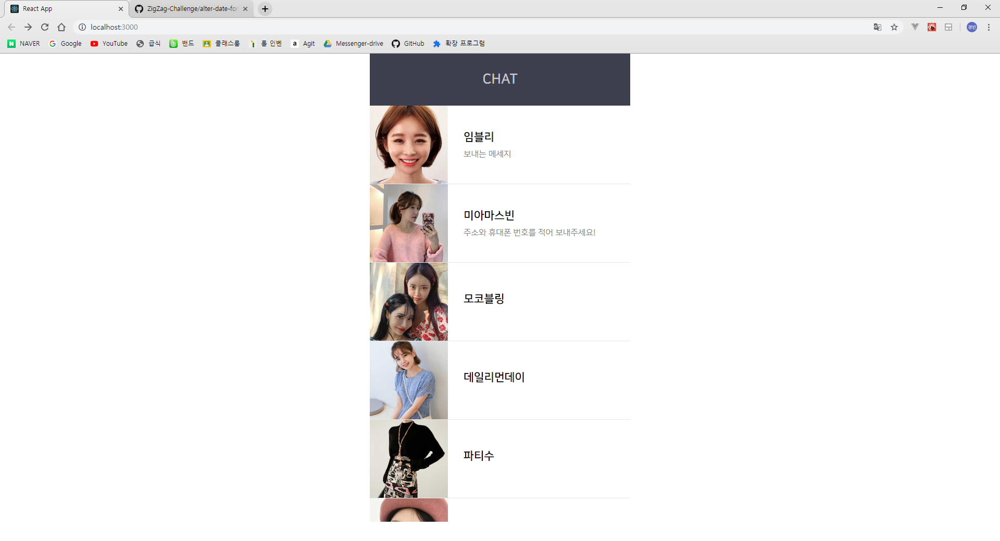
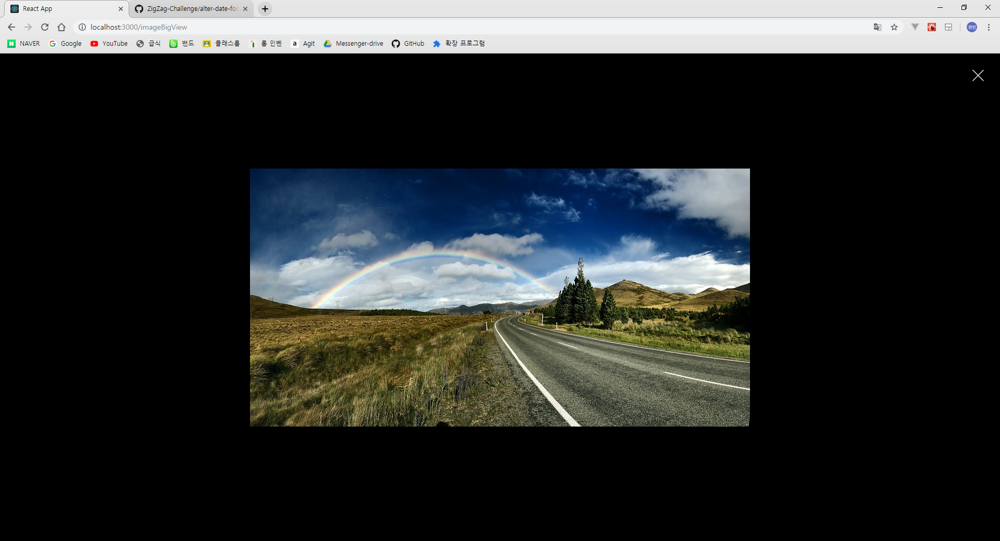

# rich-web

## 간단한 채팅 웹 어플리케이션

### 사용하는법

패키지 설치

```
$ yarn
```

실행

```
$ yarn start
```

브라우저를 열고 http://localhost:3000/ 로 접속하면 사용할 수 있다.

### 결과

#### 메인 화면



#### 채팅창 화면


### 기능

- 채팅창 목록 조회
- 채팅창 선택
- 뒤로가기
- 채팅 전송(텍스트, 이미지, 파일)
- 채팅방 이름 수정

- 이미지 자세히 보기



- 파일 다운로드


### 기타

- ChatReceiveItem에는 이미지, 파일을 구현하지 않았다.
- 서버 대신 MobX 스토어를 통해 구현하였다.
